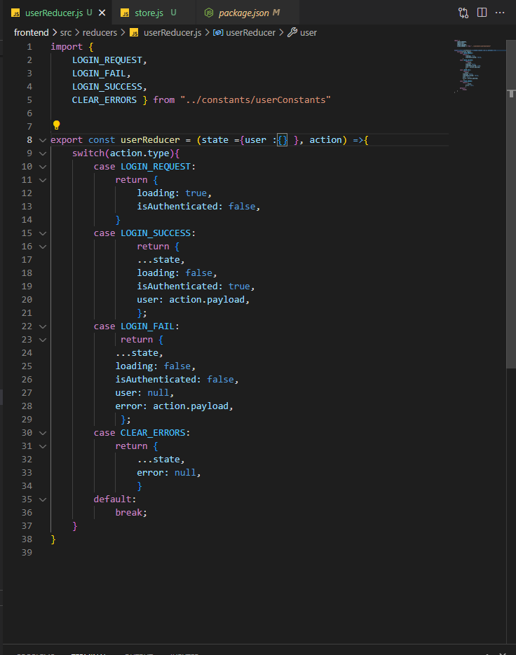
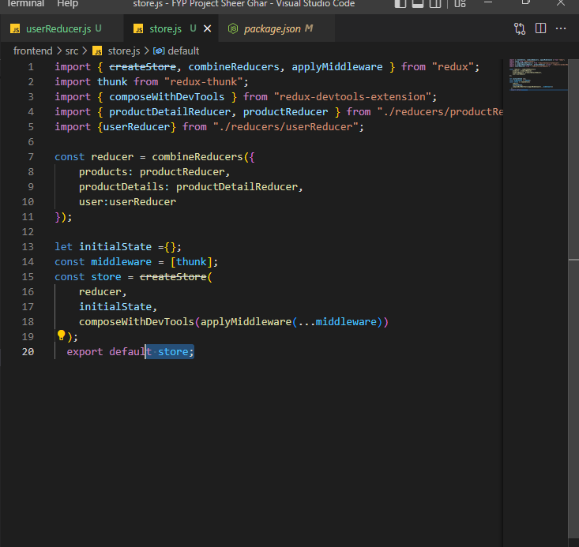

Questions are an essential part of learning and understanding how the world works. In a perfect world where everyone understands everything and everyone around them, then questions wouldn’t be as important as they are now, but we do not live in such a world. As software engineers we immerse ourselves in a world of ever changing technology and it is our job to keep up or get ahead  with current trends. Asking smart questions is one of the best ways to keep up to date with current events and the latest trends.

<h2>Now how do I write smart questions?</h2> 

In order to write smart questions, you must know the following.

<ol>
  <li>Understand your problem.</li>
    <ul style = "margin-left: -2em">
      <li>if you don't know your problem, then how can you ask for proper help?</li>
    </ul>
  <li>Have a clear title</li>
    <ul style = "margin-left: -2em">
    <li>The first thing people will see is the title. if the title itself is confusing then no one will ever consider looking at your post.</li>
    </ul>
  <li>Ask Specific Questions</li>
    <ul style = "margin-left: -2em">
    <li>thats how you're going to get specific answers!</li>
    </ul>
  <li>Explain your problem clearly and what you've already tried</li>
    <ul style = "margin-left: -2em">
    <li>its good to have everyone on the same page</li>
    <li>if you let them know, then you won't get answers you already tried</li>
    </ul>
  <li>if your question is about code, include the written code within the post, no picture!
    <ul style = "margin-left: -2em">
    <li>no one is going to help you if you are just going to put pictures of your code. it will make their life easier if they could just copy and paste it</li>
    </ul>
</ol>
  
<h2> Example of a Good Question: </h2>
<h4 href = "https://stackoverflow.com/questions/522563/accessing-the-index-in-for-loops"> Accessing the index in 'for' loops> </h4>

How do I access the index while iterating over a sequence with a for loop?
```
xs = [8,23,45]

for x in xs:
  print("item #{} = {}",format(index, x))
```
Desired Output
```
item #1 = 8
item #2 = 23
item #3 = 45
```

This question is very simple, but informative. Here the user was very specific in the title, only asking one question. The writer of the question also wrote his code within the forum post, instead of posting a picture. Having the code written within the forum post is extremely helpful because this allows the other users to just copy and paste that code and test it. Especially when there are almost 100 lines of code.

<h2> Example of a Bad Question: </h2>
<h4 href = "https://stackoverflow.com/questions/73654192/webpage-disappear-when-i-add-user-userreducer-in-my-store-js-file"> Webpage disappear when i add user: userReducer, in my store.js file </h4>

<div align = "center">
  
  
  
</div>

As, products: productReducer, productDetails:productDetailReducer, was working perfectly fine but when I add user:userReducer Screen disappeared.

This question is a prime example of a bad question. First off the title isn't very helpful at all, it isn't even asking a question. It's just a description of their problem. Second, the user did not even write the code in the forum post, he just linked three pictures to an image hosting website. Not to mention the description of the problem is just straight nonsense. There's a reason why the post is already closed with only one response.
