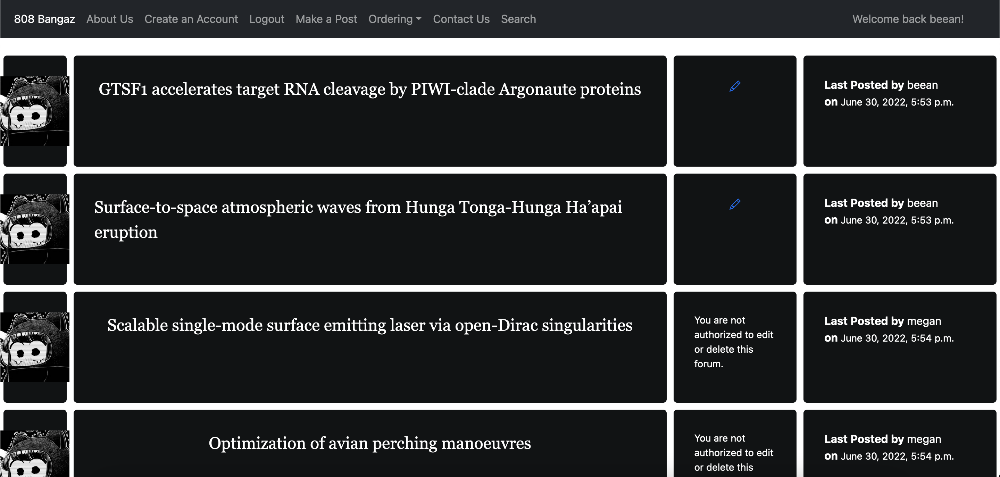
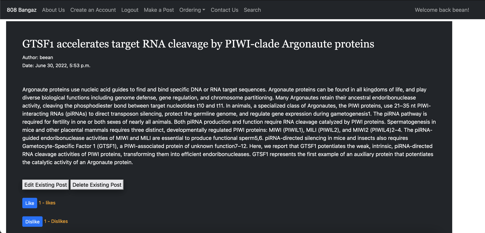

  
  

This project was conducted in EE491F Data Driven Web Development in the summer of 2022.
My team members were tasked in making a website that utulizes CURD techniques and that is accessible on the internet.

<h2> Our insperation </h2>

My team members and I were inspired to make a fourm posting website because of Reddit. Reddit is a network of communites where people can talk
about their hobbies, interests, and passion. Reddit basically almosts has a community for anything, wether it be sharing dog/cat videos, college advice, work advice, or even politics.

<h2> My responsibilities </h2>

My responsibilities with in the project were to create a working NavBar, like/dislike system, and the whole website layout.
Below is a video explaing all the features within the website.

 
  <iframe class = "text-center p-4" width="560" height="315" src="https://www.youtube.com/embed/FfZlbhwb9ME" title="YouTube video player" frameborder="0" allow="accelerometer; autoplay; clipboard-write; encrypted-media; gyroscope; picture-in-picture" allowfullscreen></iframe>

For those interested heres a link to our sites <a href = "https://github.com/EE491F-808Bangaz/808bangazforum">  github repository </a>