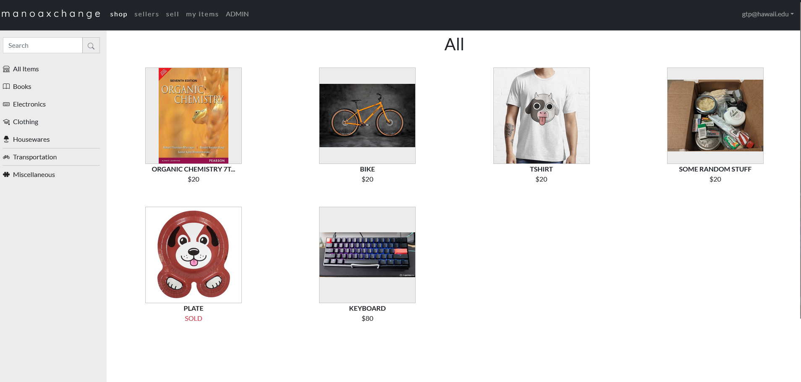
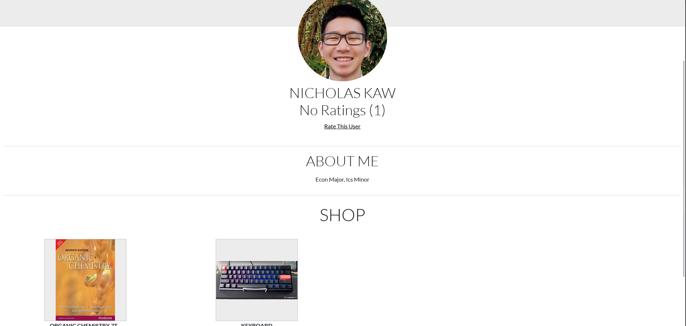
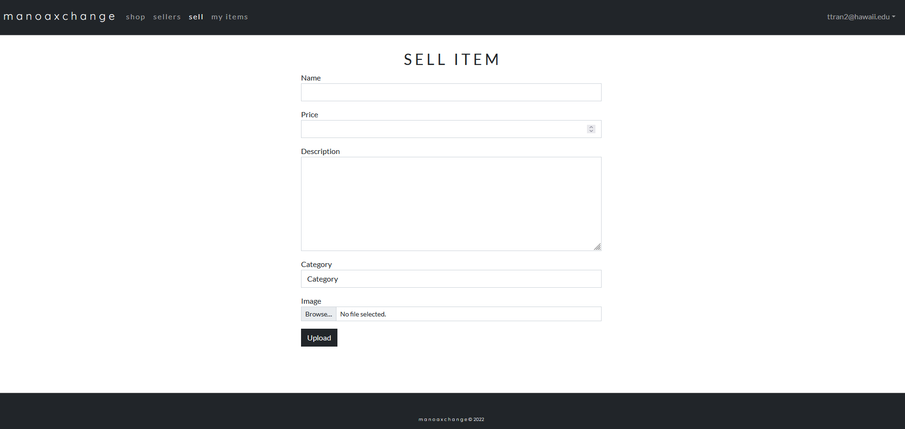
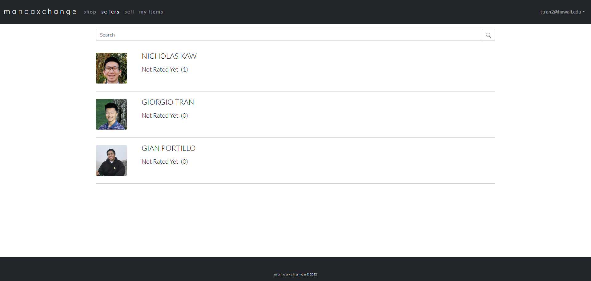
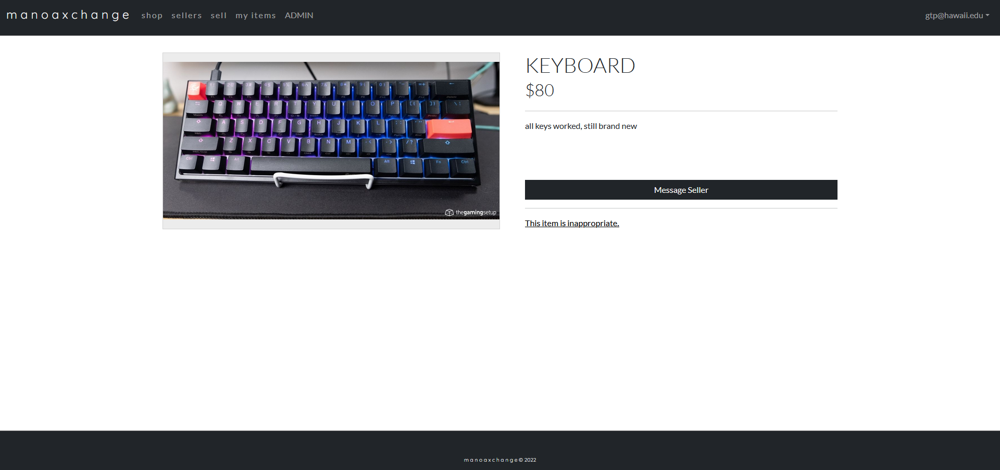

## Manoa Xchange

This was my group project for ICS 314. We wanted to create a web application that would allow college students to put up unwanted items for sale. 

Living on campus tends to be a short lived experience. Many students either move into off campus housing or go abroad after finishing their degree(s). Lots of campus specific goods are built up, and there is a need for a marketplace where students can buy and sell them. Introducing Manoa Xchange, a convenient marketplace application that does just that!

Shown below are some images of the final product can be seen below. Users were able to put items up for sell, rate other user profiles, message other users via an email system, search items, and report inappropriate items. Users could also create an account and become sellers. Admins could view a list of all reported items and remove the items from the website or remove the report if the item was falsely reported.

  
  
  
  
  

In this project I worked on the Item Page, Sellers Page, Sellers Profile, I also worked with mongoDB to get user data linked to specific items and profiles. This project let me test my skills that were obtained in ICS 314, such as Meteor, Bootstrap, React, and JavaScript. I was also able to experience working in groups and utilizing Github issues and project boards which organized worked flow and emphasized version control.

For those interested here's a link to our application <a href = "https://manoaxchange.github.io/">  Organization Page. </a>