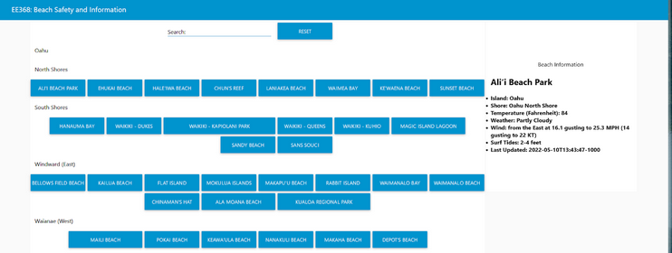
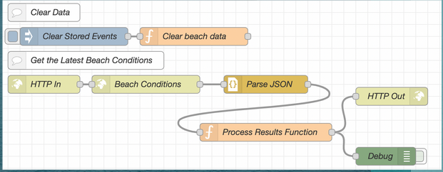

<p align = "center">
  
</p>

NALU is a project for EE368 Cyber-Physical Systems. My team members and I were tasked with developing an IoT device that would utulize a web API along with a raspberry pu and sensor kit. After a long and difficult brainstorming session we came to a decision make a product around. 


<h2> Our Design </h2>
Users will be able to select or search from a variety of beaches across Hawai'i, After selecting a beach, the Raspberry Pi device with the use of a SenseHAT will display real-time data based on the actions the user performs.

<h2> Our UI </h2>
Currently the website shows all beaches from the islands. These beaches are grouped by island, then by shore. When a button is clicked it will show the following: Beach name, Island Location, Shore, Temperature, wind, Surf Tide, and when the imformation was updated.

<p align = "center">
  
</p>

<h2> My Responsibilities </h2>
For this project I was tasked with the User Interface website design and layout, basically I organized the beaches by island and shore. I also was responsible with displaying the data on the website. 

Below I will show the snippet of code I worked on for the project:
```
let beaches = beaches.indexOf(button);
if(beaches != -1){
    var surf = beachdata[beachs];
    flow.set("beachSafety", surf);
    var loadbeach = "<h1>" + beachdata[beachs].beach + "</h1>";
    loadbeach = loeadbeacg + "<li>Island: " + beachdata[beachs].island + "</li>"
    loadbeach = loeadbeacg + "<li>Shore: " + beachdata[beachs].Shore + "</li>"
    loadbeach = loeadbeacg + "<li>Temperature (Fahrenheit): " + beachdata[beachs].temp + "</li>"
    loadbeach = loeadbeacg + "<li>Weather: " + beachdata[beachs].weather + "</li>"
    loadbeach = loeadbeacg + "<li>Wind: " + beachdata[beachs].wind + "</li>"
    loadbeach = loeadbeacg + "<li>Surf Tides: " + beachdata[beachs].surf + "</li>"
    loadbeach = loeadbeacg + "<li>Last Updated: " + beachdata[beachs].updated + "</li>"
    msg.payload = loadbeach;
}else{
  msg.payload = "<h1> Beach not found </h1>";
}
```
<h2> How we retrieved our Data </h2>
We decided to get our real world data from the Hawai'i Beach Safety API. We then created a function to parse through the JSON file and store it making it easer to access and work with.

<p align = "center">
  
</p>


<h2> Project Video </h2>

<p align = "center">
  <iframe width="560" height="315" src="https://www.youtube.com/embed/TPokvyT3zXM" title="YouTube video player" frameborder="0" allow="accelerometer; autoplay; clipboard-write; encrypted-media; gyroscope; picture-in-picture" allowfullscreen></iframe>
</p>