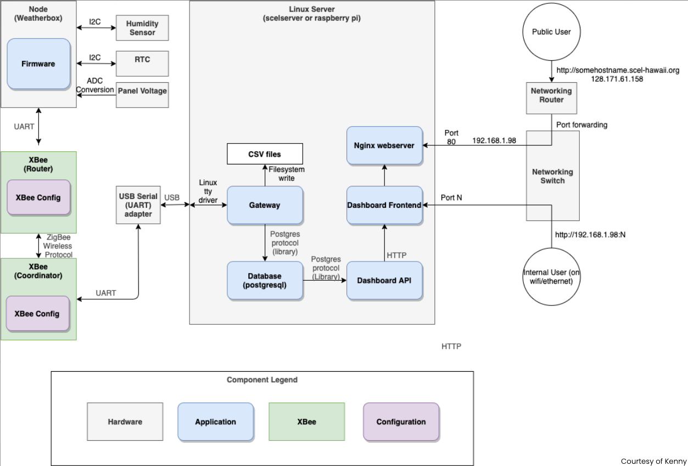
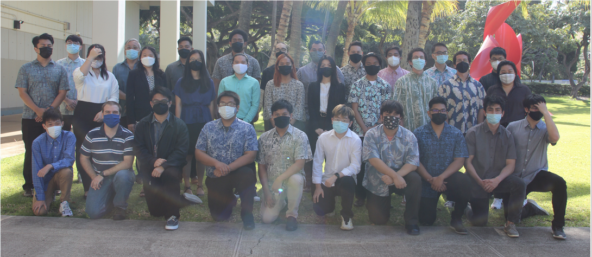

  
  

<h2> What is SCEL </h2>

SCEL stand for Smart Campus Energy Lab. SCEL is a student-led lab managed by Dr. Anthony Kuh. SCELs main objective is to offer students the opertunity to work on energy and sustainability projects to assists with the states and university energy goals.
 
Students will work outside the classroom to gain experience working on multidisiciplinary projects that invoke more typify work related to the industry
  
it also gives students the oppertunity to work on group projects to build soft skills such as
<ul>
  <li> Leadership </li>
  <li> Communications </li>
  <li> Teamwork </li>
  <li> Ethics </li>
  <li> Sustainability </li>
  <li> Globalization </li>
</ul>

 

<h2> What are the States and Universities Energy goals? </h2>

As stated previously SCELs objective is to assist the state and universities energy goals.
The state of hawaii has a Hawai'i clean energy initiative stating by 2030 40% of energy are from renewable sources and 30% savings in energy. The Hawai'i state government also passed a bill with a goal of attaining 100% clean energy by 2045.
 
UH Manoa aligned themselves with the state of Hawai'is energy goals so that means more energy generation (solar) and more intelligent energy management.

 

<h2> Our Objective </h2>

SCEL focused on designing, fabricating, and deploying a network of sensor modules across the universities campuses to collect meterological data. We would collect and analyze temperature, solar irradiance, humidity, and pressure.
 
There were four different teams within SCEL. Apple and Guava were the hardware teams where they  actually designed and fabricated the weatherboxes. BumbleBee, another hardware team, focused on understanding and limit testing the capabilities of xBees, which was the way weatherboxes would communicated with each other and our server.
 
I was apart of the Firmware team which focuses on maintaining the code for the weatherboxes and implementing improvements for gatherdata. While I apart of the Firmware team we created a staging envrioment. The staging enviroment provided hardware teams a proper way to see if their weatherboxes worked without destroying the production line. We also converted our gateway server code from Python2 to Python3. We were also responsible in assisting hardware teams with anything related to the weatherbox code, gathering data, or testing issues.
 

  

    
  

 
<h2> My Takeaways </h2>

While being in SCEL and the Firmware team, I leanred a lot of skills that will assist me in my professional career. Such as version control using Git and GitHub and communicating and working as a team. I also learned how the sensors on the weatherboxes communicate and send data to the gateway server using gateways. 
 
I am forever greatful for SCEL because it was such a great experience. Not only did it educate me about renewable energy and how data gets collected and stored, but I was able to meet amazing people through this lab who I can call great friends.
 
For those interested heres a link to the <a href = "https://wiki.scel-hawaii.org/doku.php?id=start"> SCEL Wiki </a>

